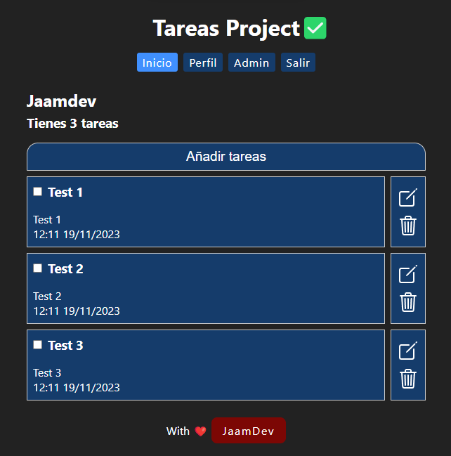

# Tasks Project | Frontend

El frontend del proyecto de gestión de tareas y usuarios.

Para la parte backend clic [aquí](https://github.com/jaamdev/tasks-backend-project).

[](https://tasks-frontend-project.vercel.app)
[](https://github.com/jaamdev/tasks-frontend-project)

## Vista



## Tecnologías usadas


## Descripción

### Gestor de tareas _(ToDo)_, con registro de usuarios, _backend_, base de datos en _mongo_, Tokens con JWT y cifrado de contraseñas

## Cómo usarlo

Para entrar solo hay que registrarse con una cuenta de correo electrónico que puede ser uno inventado como _hola@hola.com_, un nombre cualquiera y una contraseña.

Luego iniciar sesión con el correo electrónico registrado y contraseña. Y ya se puede acceder a crear tareas, editarlas y borrarlas.

También el usuario puede editar su cuenta para cambiar su correo electrónico y contraseña o puede también eliminar su cuenta.

Si se elimina la cuenta las tareas asociadas a esa cuenta serán eliminadas de la base de datos de forma automática.

## Por qué lo hice

El típico _**ToDo**_ que todos hacen pero quise darle más complejidad y hacerlo diferente añadiendo tanto base de datos como una API propia, ya que no tenía ni idea de cómo hacer un proyecto con esas tecnologías.

## Lo que aprendí

Me ayudó a consolidar más ReactJS, JavaScript, HTML y CSS Modules.

Y sobre todo el uso de la API Fetch, funciones asíncronas y promesas.

## Documentación

### Vídeos

| Nombre | Vídeo |
| -: | :- |
| Desarrollo Útil | [Curso NodeJS](https://youtube.com/playlist?list=PL3aEngjGbYhnrRfZKMxzn79qdgPxL7OWM&si=_LAMW0hbw-zPEgXM) |
|  | [Curso ReactJS](https://youtube.com/playlist?list=PL3aEngjGbYhkg3AR-cytsvQIIGp1JgrY_&si=KBJI1oRKG6BpvCeE) |
| Midudev | [Curso NodeJS](https://youtube.com/playlist?list=PLUofhDIg_38qm2oPOV-IRTTEKyrVBBaU7&si=_XkHQqml-Rq6fhAf) |
|  | [Curso ReactJS](https://youtube.com/playlist?list=PLUofhDIg_38q4D0xNWp7FEHOTcZhjWJ29&si=-6eJ_DfGQZSYLa53) |
| Fazt Code | [CRUD NodeJS](https://youtu.be/NmkY4JgS21A?si=lTsI4rDnl_2II-Wd) |

### Info

| Nombre | Info |
| -: | :- |
| Vite | [https://vitejs.dev](https://vitejs.dev) |
| React | [https://react.dev](https://react.dev) |
| React Router | [https://reactrouter.com](https://reactrouter.com) |
| DayJS | [https://day.js.org](https://day.js.org) |

## Instalación

1. Clonar el repositorio

```bash
git clone https://github.com/jaamdev/tasks-frontend-project.git
```

2. Instalar las dependencias

```bash
npm install
```

3. Iniciar servidor de desarrollo

```bash
npm run dev
```
